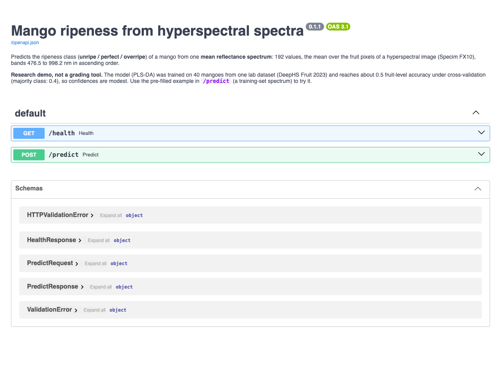
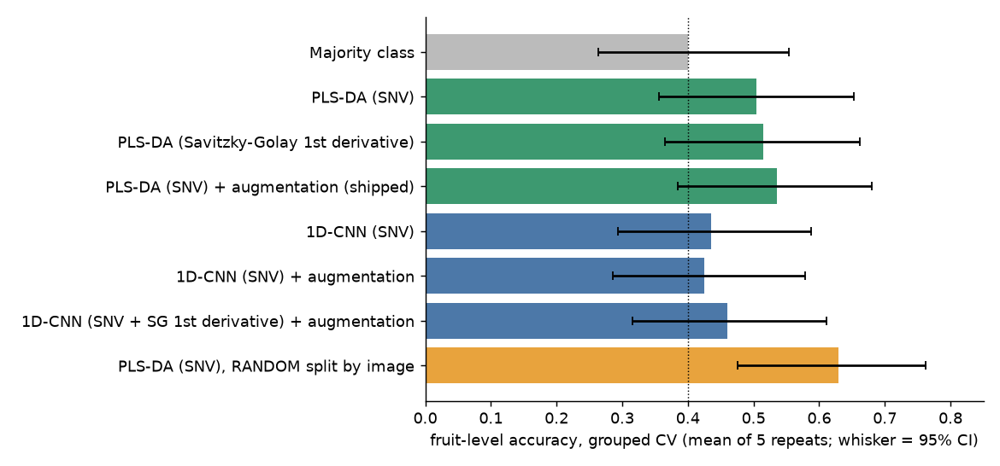
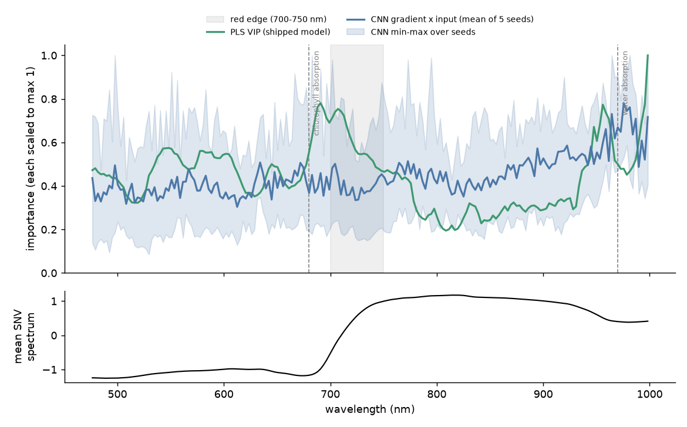
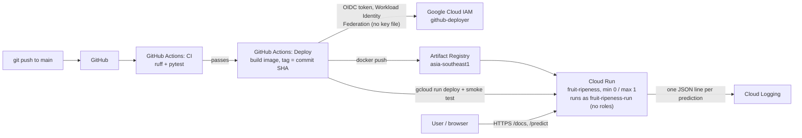

# fruit-ripeness-hsi

[](https://github.com/pnastra/fruit-ripeness-hsi/actions/workflows/ci.yml)

**Predict mango ripeness (unripe / perfect / overripe) from a hyperspectral image, with an honest
comparison of a classic chemometrics model (PLS-DA) against a 1D-CNN, served as an API on Google
Cloud Run with automatic tests and deploys.**

**Live demo: <https://fruit-ripeness-581425276724.asia-southeast1.run.app/docs>**
(open `POST /predict`, *Try it out*, *Execute*: the request is pre-filled with a sample spectrum).
The service scales to zero, so the first request after a quiet period takes ~3 s (cold start), later ones ~0.1 s.



**In one paragraph.** 40 labelled mangoes, imaged with a Specim FX10 camera (192 bands, 476-998 nm).
Each image becomes one mean spectrum of the fruit. Under cross-validation **grouped by fruit**, PLS-DA
reaches **0.535 fruit-level accuracy** (95% CI 0.38-0.68) against **0.40** for always guessing the
most common class; a label-permutation test says that signal is real (p = 0.016) but modest. **The
1D-CNN did not beat PLS-DA** (best 0.46). A random split by image would have reported 0.63: the same
fruit leaking into train and test. PLS-DA ships, as a 21 KB JSON model served by plain NumPy in a 109 MB container.

---

## Contents
[Results](#results) · [Findings from the data](#findings-from-the-data) · [Which wavelengths matter](#which-wavelengths-matter) ·
[Method](#method) · [Architecture](#architecture) · [Model card](#model-card) · [Use the API](#use-the-api) ·
[Run it yourself](#run-it-yourself) · [Repository layout](#repository-layout) · [Data, license and credits](#data-license-and-credits)

---

## Results

Repeated stratified group k-fold **by fruit** (5 folds x 5 repeats; every fruit is in train *or* test,
never both). Fruit-level accuracy averages the front and back image of each fruit. The interval is a
95% Wilson interval for 40 fruits: one fruit is 2.5 points, so treat differences of a few points as noise.

| Model | Fruit accuracy (95% CI) | Fruit macro-F1 | Image accuracy |
|---|---|---|---|
| Majority class (always "perfect") | 0.400 (0.26-0.55) | 0.190 | 0.400 |
| PLS-DA (SNV) | 0.505 (0.36-0.65) | 0.490 | 0.508 |
| PLS-DA (Savitzky-Golay 1st derivative) | 0.515 (0.37-0.66) | 0.493 | 0.530 |
| **PLS-DA (SNV) + augmentation (shipped)** | **0.535 (0.38-0.68)** | **0.516** | 0.520 |
| 1D-CNN (SNV) | 0.435 (0.29-0.59) | 0.405 | 0.422 |
| 1D-CNN (SNV) + augmentation | 0.425 (0.29-0.58) | 0.390 | 0.432 |
| 1D-CNN (SNV + SG 1st derivative) + augmentation | 0.460 (0.32-0.61) | 0.435 | 0.445 |
| *PLS-DA (SNV), random split by image: leakage demo, not a result* | *0.630 (0.48-0.76)* | *0.613* | *0.598* |



**How to read it**
- **PLS-DA beats the majority class, but only modestly.** The intervals overlap; the evidence that the
  signal is real is a label-permutation test: shuffling the labels across fruits and rerunning the
  identical protocol 60 times gave a null mean of 0.35 and a maximum of 0.49, against 0.535 observed (p = 0.016).
- **The 1D-CNN did not beat PLS-DA.** With ~64 training images per fold and classes that differ only
  slightly, a linear chemometrics model with a strong prior (few latent components) has the advantage;
  the CNN had to be fixed three times just to learn (see [Method](#method)) and its attributions are
  unstable between seeds. This is a credible small-data result, not a failed experiment. Its best
  configuration was chosen among only three, so that number is if anything slightly optimistic.
- **Leakage is real.** The same fruit's front and back spectra are much closer to each other than to any
  other fruit; a random split puts them on both sides and inflates accuracy by ~12 points.
- **Augmentation** (averaging random subsets of a fruit's pixels) gave no measurable gain for either model.
- **Which classes are hard:** for PLS-DA, recall is 0.61 for perfect, 0.56 for overripe and only 0.33 for
  unripe (mostly mistaken for perfect).

Full numbers: [`docs/results.md`](docs/results.md), [`docs/results.csv`](docs/results.csv), [`docs/permutation_test.json`](docs/permutation_test.json).

## Findings from the data

From the exploratory analysis ([`notebooks/01_eda.ipynb`](notebooks/01_eda.ipynb)):

1. **Small, noisy label set.** 40 labelled mangoes (13 unripe / 16 perfect / 11 overripe), two images each
   (front and back). The same 40 fruits were imaged every day for up to 12 days, but each is labelled only on
   its last day (after destructive measurement), so the other 482 images have no label.
2. **The classes look almost the same spectrally.** All class means share the same shape (chlorophyll dip
   near 680 nm, red edge, NIR plateau, water dip near 970 nm); PCA overlaps heavily and the
   between/within-class scatter ratio is only 0.06-0.08 for every preprocessing tried.
3. **Fruit identity beats class.** Front and back of one fruit are closer (median SNV distance 0.62) than two
   different fruits of the *same* class (0.92), which is why the split must be grouped by fruit. The
   dataset's own train/val/test split puts the two sides of 18 of the 40 fruits on different sides, so it leaks; this project builds its own.
4. **Labels only loosely follow firmness** (mean 12.9k / 9.8k / 5.0k for unripe / perfect / overripe, but
   with large overlap), which caps the achievable accuracy.
5. **A chlorophyll index varies as much within one fruit as between fruits** (pixel sd 0.041 vs 0.043),
   mostly a centre-to-rim illumination gradient plus some real skin-colour patches; a whole-fruit mean blurs both.

## Which wavelengths matter



PLS VIP scores of the shipped model are highest at **680-750 nm** (chlorophyll absorption and the red
edge, whose position follows chlorophyll content, which falls as mangoes ripen) and near
**950-1000 nm** (water absorption), with a smaller bump at 540-560 nm, and lowest on the NIR plateau
(750-900 nm), which mostly reflects fruit structure and geometry: chemically plausible. The CNN's
gradient x input is nearly flat, differs a lot between training seeds (rank correlation 0.24) and
agrees with PLS only on the water band. The very top VIP value sits at the noisy last band (998 nm) and
should not be over-read. Details: [`docs/band_importance.md`](docs/band_importance.md).

## Method

| Step | What | Why |
|---|---|---|
| Data | DeepHS Fruit 2023, **Mango**, **Specim FX10** camera only (64 x 64 px crops, 224 bands) | One camera so all samples share the same bands; the other camera had identical labels but a narrower range |
| Mask | 850 nm band > 0.10, largest blob, fill holes, erode 3 px | The background is exactly 0; Otsu was tried and rejected because it cut away the dim fruit rim |
| Spectrum | Mean over the ~2,500 fruit pixels; bands outside 476-998 nm dropped | Below ~470 nm the signal-to-noise ratio is < 10 |
| Preprocessing | SNV (per-spectrum standardisation); Savitzky-Golay 1st derivative as the one alternative | Removes brightness/geometry scale; set before seeing any model score |
| Evaluation | Repeated stratified group k-fold by fruit; fruit-level metrics; Wilson CI; permutation test | 40 fruits: a single hold-out (8 fruits) is too noisy to report |
| PLS-DA | PLS regression on one-hot labels, components chosen by an inner grouped CV on training folds only | Classic, strong baseline for spectra |
| 1D-CNN | 2 conv blocks, pooled to 8 band segments, ~1.4k parameters; early stopping on whole held-out fruits | Small on purpose; three fixes were needed for it to learn: keep wavelength position (no global pooling), per-band standardisation, smoothed early stopping |
| Augmentation | Mean of a random 5% of a fruit's pixels as extra training spectra (training folds only, both models) | Tried as approved; no measurable gain |
| Probabilities | Temperature-scaled softmax of PLS-DA scores, T = 0.50 fitted on out-of-fold scores | Calibrated: mean confidence 0.54 vs out-of-fold accuracy 0.52 |

Every choice was fixed on training data or before evaluation, never on test scores. All runs are
logged with MLflow (`mlflow.db`, local only).

## Architecture



- **CI** (`.github/workflows/ci.yml`) runs on every push and pull request. Tests that need the dataset skip themselves.
- **CD** (`.github/workflows/deploy.yml`) runs only after CI succeeds on `main`. GitHub's short-lived OIDC
  token is exchanged through Workload Identity Federation for a ~1 h token of a deploy service account that
  can only push to this registry and deploy this one service, and only from this repository.
- **Monitoring:** each prediction writes one structured log line (time, model version, class, confidence;
  never the input) that Cloud Logging indexes.
- **Cost:** scale to zero, max one instance, a 109 MB image, a budget alert.

## Model card

| | |
|---|---|
| **Model** | PLS-DA (8 latent components) on SNV-normalised mean spectra, with temperature-scaled probabilities. File: [`models/plsda_snv.json`](models/plsda_snv.json), version `plsda-snv-aug-0.1.0` |
| **Input** | One mean reflectance spectrum of the fruit: 192 values, 476.5 to 998.2 nm ascending, as produced by `make features` from a Specim FX10 image |
| **Output** | `unripe` / `perfect` / `overripe` with probabilities |
| **Intended use** | Demonstrating a spectral-imaging ML pipeline and its evaluation. A research and portfolio demo |
| **Not for** | Commercial grading, food-safety or purchasing decisions, or any decision about real fruit |
| **Training data** | 80 images of 40 mangoes from one lab dataset (DeepHS Fruit 2023), labelled by the dataset authors on each fruit's last imaging day |
| **Performance** | Fruit-level accuracy 0.535 (95% CI 0.38-0.68), macro-F1 0.52, under grouped cross-validation; majority class 0.40. Unripe fruit is recognised worst (recall 0.33) |
| **Limitations** | One fruit species, one camera, one lab setup and lighting, one season; a small sample (40 fruits) so every number carries about +-15 points of uncertainty; labels only loosely follow firmness; a whole-fruit mean ignores where on the fruit ripening shows. Spectra from another camera or preprocessing will give meaningless predictions |
| **Confidence** | Calibrated but modest: typical confidences are 0.4-0.6. The sample spectra in `samples/` come from the training images, so they are for trying the API, not for judging it |
| **Data license** | Not stated by the dataset authors; asked by email on 1 Oct 2026, awaiting reply (see below) |

## Use the API

```bash
URL=https://fruit-ripeness-581425276724.asia-southeast1.run.app
curl $URL/health
curl -X POST $URL/predict -H 'content-type: application/json' -d @samples/perfect_front.json
# {"predicted_class":"perfect","confidence":0.38,"probabilities":{...},"model_version":"plsda-snv-aug-0.1.0"}
```

A spectrum of the wrong length, with NaN or infinite values, or completely flat returns `422`.

## Run it yourself

Requirements: macOS or Linux, [`uv`](https://docs.astral.sh/uv/), ~10 GB free disk; Docker for the container; `gcloud` only for deploying.

```bash
git clone https://github.com/pnastra/fruit-ripeness-hsi && cd fruit-ripeness-hsi
uv sync                      # Python 3.12 + all dependencies from uv.lock
uv run pytest                # works without the dataset (data-dependent tests skip)

# serve the committed model, no dataset needed
make serve                   # http://127.0.0.1:8000/docs
make docker-build && make docker-run   # same API in the container: http://localhost:8080/docs

# full pipeline (downloads the 2.7 GB Mango zip + annotations, resumable)
make data                    # -> data/raw/
make inventory               # -> data/processed/inventory.parquet
make features                # masks + mean spectra -> data/processed/spectra.parquet, pixels.npz
make train-baseline          # majority, PLS-DA, leakage demo -> MLflow (mlflow.db)
make train-cnn               # three 1D-CNN configurations -> MLflow
make model                   # final PLS-DA on all labelled fruits -> models/plsda_snv.json
make report                  # docs/results.md + chart (add ARGS="--permutation 30" for the permutation test)
make explain                 # docs/band_importance.png
uv run mlflow ui --backend-store-uri sqlite:///mlflow.db   # browse all runs
```

Deploying your own copy: create a Google Cloud project, an Artifact Registry Docker repository and a
Cloud Run service (see `PLAN.md` §10), then `make deploy` (builds the current commit, pushes, deploys).
Automatic deploys additionally need a Workload Identity pool and provider for your repository, a deploy
service account, and the repository variables `WIF_PROVIDER`, `DEPLOY_SA` and `RUN_SA` used by
`deploy.yml`; the exact commands are logged in `PLAN.md` §12 (M11).

## Repository layout

```
api/main.py                 FastAPI service: /health, /predict, JSON prediction logging
src/fruithsi/
  io.py                     ENVI cubes, annotations, inventory
  preprocess.py             mask, mean spectra, SNV / Savitzky-Golay, pixel spectra
  split.py                  grouped (and leakage-demo random) splits
  baseline.py               majority, PLS-DA, augmentation wrapper, CV protocol, permutation test
  dataset.py, model.py, train.py   PyTorch Dataset, 1D-CNN, training loop with early stopping
  evaluate.py               image- and fruit-level metrics, Wilson interval
  export.py / predict.py    train-side export / numpy-only serving of the shipped model
  report.py, explain.py     results table and chart, band importance
models/plsda_snv.json       the shipped model (21 KB)
samples/                    5 derived mean spectra for trying the API (no images)
docs/                       results, figures, screenshot
notebooks/01_eda.ipynb      exploratory analysis (aggregate plots only)
tests/                      63 tests (pytest)
.github/workflows/          CI and CD
PLAN.md                     milestone plan and a dated log of every decision
```

## Data, license and credits

**Data:** DeepHS Fruit 2023 datasets, Cognitive Systems Lab, University of Tübingen:
<https://cogsys.cs.uni-tuebingen.de/webprojects/DeepHS-Fruit-2023-Datasets/>.

**Dataset license: not stated** on the download page, in the dataset readme, or in the
[authors' code repository](https://github.com/cogsys-tuebingen/deephs_fruit) (checked 29 Sep 2026).
I emailed the authors on 1 Oct 2026 to ask under what terms the data may be used (status: awaiting
reply). Until then this repository contains **no dataset images**: only derived outputs (predictions,
mean spectra, aggregate plots). The data itself is downloaded from the authors' site by `make data`.

**Please cite the authors' work** if you use the data:

```bibtex
@inproceedings{Varga2021,
  author    = {Varga, Leon Amadeus and Makowski, Jan and Zell, Andreas},
  title     = {{Measuring the Ripeness of Fruit with Hyperspectral Imaging and Deep Learning}},
  booktitle = {2021 International Joint Conference on Neural Networks (IJCNN)},
  pages     = {1--8},
  year      = {2021},
  publisher = {IEEE},
  doi       = {10.1109/IJCNN52387.2021.9533728},
  eprint    = {2104.09808},
  archivePrefix = {arXiv}
}
```

**Code:** MIT licensed (see [`LICENSE`](LICENSE)); the license covers the code in this repository only, not the dataset.
